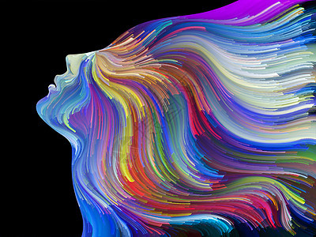
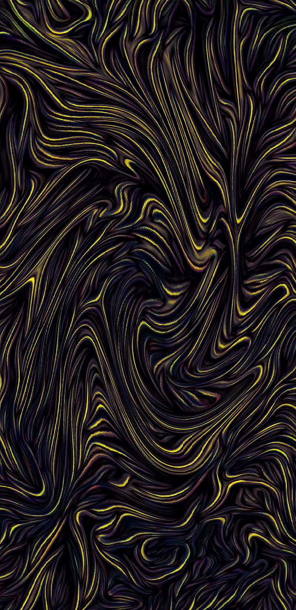
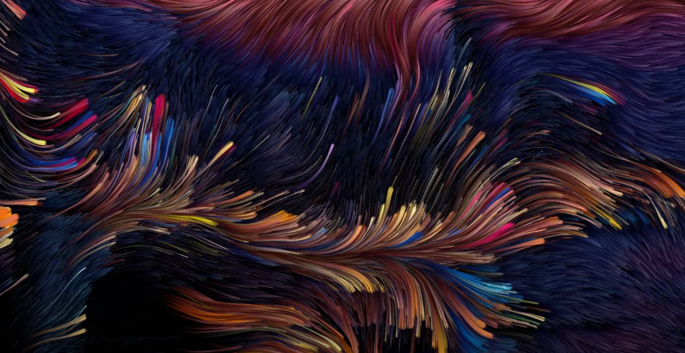
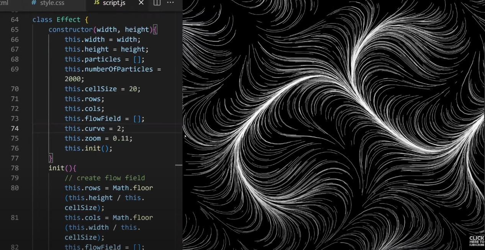
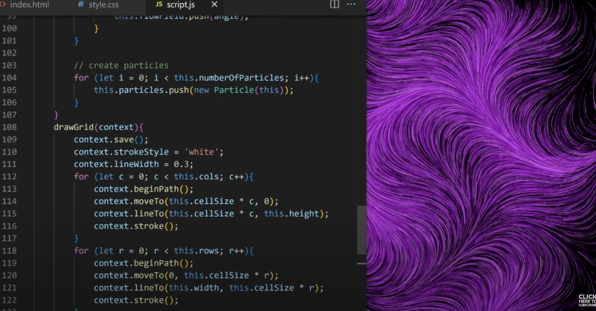

# zwan0223_9103_wee8-quiz

## 1.Imaging Technique Inspiration

I got some inspiration for my imaging technique from these art drawings. The lines or dots in these art pictures spread in different directions to form new patterns (figures, abstract illustrations, etc.). This effect visualises the composition of a photograph and stimulates the user's interest in knowing what pattern it will form next. I want to incorporate this technique into my project, where the flow of lines from 0 to the formation of a picture creates a new sense of things and a strong visual impact.

---

## 2.Coding Technique Exploration

(https://www.youtube.com/watch?v=MJNy2mdCt20)
These codes often simulate the flow of fluids, gases, etc., through space. First, a flow field needs to be created. It can be an array and visualised as a grid, where each grid represents a position or direction. Thus, the flow field can be defined. Then comes how to generate particles. Write the particle class through class Particle, then initialise it through class Effect and finally use the init function to push new particles in. Finally, they are combined to realise the flow field effect.

(https://www.youtube.com/watch?v=MJNy2mdCt20)